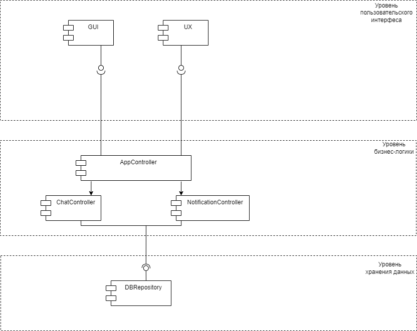

## Урок 10. Структура приложения с пользовательским интерфейсом и базой данных (паттерн Repository)
### Разработать приложение мессенджера (на выбор desktop/web/mobile). Требуется написать use case диаграмму, выбрать архитектуру для приложения (кратко обосновать выбор), UML и ER диаграммы для выбранной архитектуры. Используя метод персон (не менее 3), описать каких функций не хватает. Пересмотреть UML и ER диаграммы с учетом недостатков. Создать интерфейс в figma для приложения.
### 1. UseCase Диаграмма.

### Архитектура: MVP (Model-View-Presenter) MVP была выбрана, так как она обеспечивает разделение логики приложения на три основных компонента: модель, представление и презентер. Это позволяет упростить разработку и поддержку приложения, а также обеспечить его масштабируемость.
### 2. UML Диаграмма.

### 2. Реляционная ER диаграммы для БД.

[Design](https://github.com/Painkillerap/Software_Architecture/tree/main/HW10/Desing)