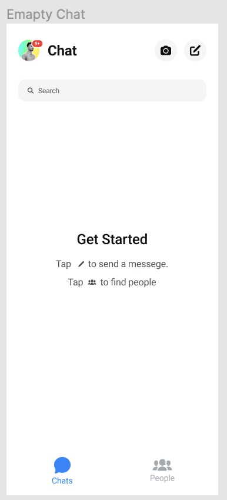

# Домашнее задание 12
## Структура приложения с пользовательским интерфейсом и базой данных

Архитектура: MVP (Model-View-Presenter)
MVP была выбрана, так как она обеспечивает разделение логики приложения на три основных компонента: модель, представление и презентер. Это позволяет упростить разработку и поддержку приложения, а также обеспечить его масштабируемость.

### Планируемая UseCase:

### Планируемая UML:

### Планируемая ERD:

Планируемый дизайн:

## Реализация мессенджера

На базе языка java спроектированы: страничка авторизации с кнопками входа и регистрации; Страничка регистрации с добавлением пары логина и пароля в текстовый файл; окно мессенджера.

[Проект](src/)

## Тестирование
План тестирования приложения

Unit – тесты: Пишутся по мере написания кода на классы и методы API облачного сервиса, API обновления, авторизации и мобильного приложения.

E2E-тестирование: Проводим после завершения работы над кодом. Тестируем каждую систему на работоспособность. При этом воздействуем на систему через ее самые внешние интерфейсы и проверяем ожидаемую реакцию системы через эти же интерфейсы. 

UAT – тестирование: готовый программный продукт тестирует ограниченный круг пользователей. Тестируется каждый case из UseCase диаграммы. При этом группа людей изучает эффективность сервиса, его функционала. UAT нужен для того, чтобы понять: а) как ведет себя продукт в реальных условиях, соответствует ли результат задумке; б) выявить, были ли добавлены все возможные функции; в) проверить, есть ли ошибки, которые будут мешать пользователю.

В процессе UAT-тестирования программы были выявлены следующие недоработки программы:
1. Не работает кнопка добавления нового контакта;
2. Не отправляются сообщения;